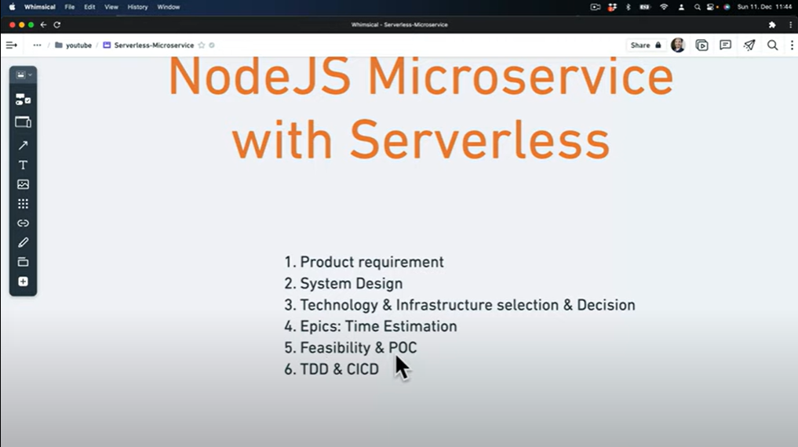
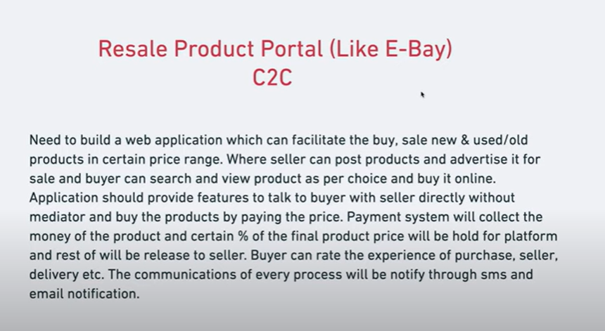
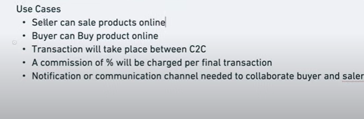
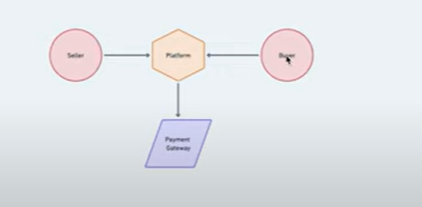
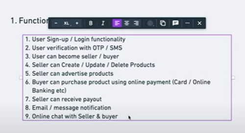
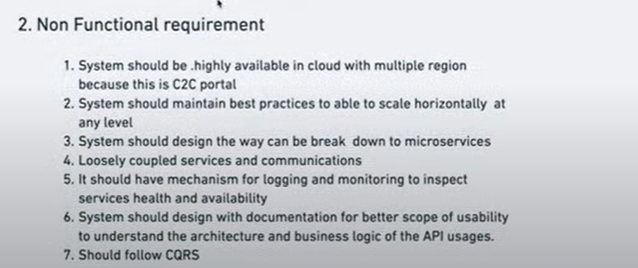
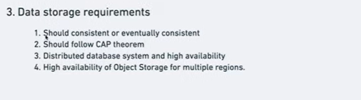
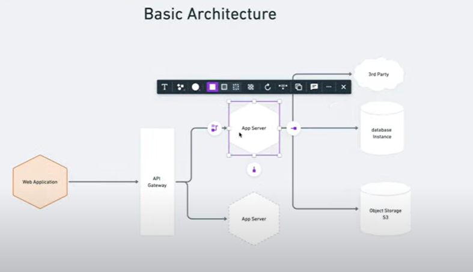

# 3 May

## Ep-1(Theory)(continue @ 24:00)

### Product requirements

1. 
2. We need to create a website similar to ebay. Here are the requirements
   
3. These are the usecases we need to cover in this application
   

4. Here is the basic requirement in flow diagram
   

### System Design

1. Functional Requirements

- 

2. Non functional requirements

- 

3. Data storage requirements

- 

4. Basic Architecture

- 
