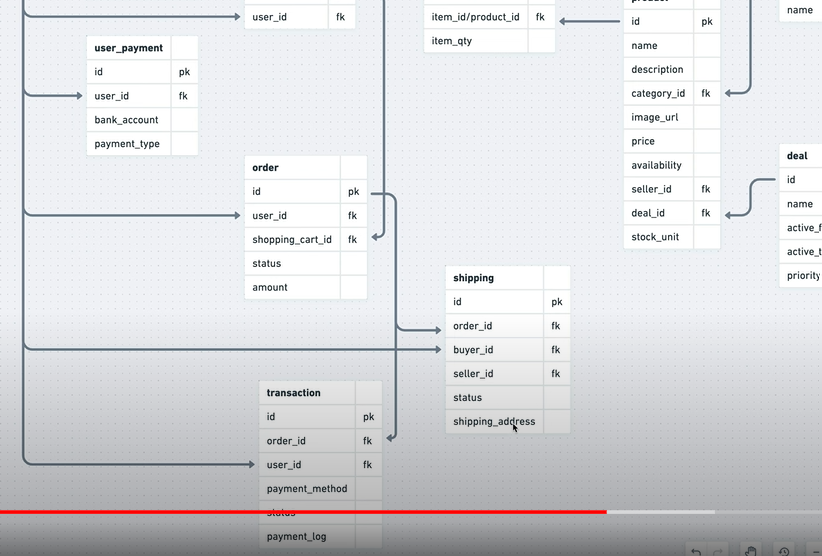
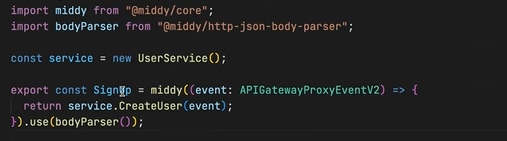

# 3 May

## Ep-1(Theory)

## Ep-2

1. Database design

- Expectation from database
  
- 

- User Table
  

- Product table definiation
  

- Order and transaction table
  

- Participant and live chat tables
  

2. Service Endpoints
   

- User endpoints
  

- Product endpoints
  

- Transaction endpoints
  

- Live chat endpoints
  

## Ep-3

1. Run serverless and download the aws cli
2. Configure the user service.
3. Install ts in user service
4. Install serverless offline
   
5. add typescript plugin
   

6. Now initialize the typescript using tsc --init.
7. Install these packages
   

8. Configure the tsconfig.json
9. delete index.js

# 4 May

## Ep-3

1. Update the yaml file like this
   

2. Create handler.ts in app folder and write code like this
   

3. Add dev script "serverless offline"
4. Please add async in the handler.

## Ep-4 (continue @17:00)

1. Add the remaining points
   

2. Create this directory structure
   

3. Refactor the code.
4. Add user service and user repo code like this
   

5. Create dto folder in models.
6. Add createUser in UserService like this
   

7. Create successResponse and errorResponse in utils
   
   

# 5 May

## Ep-4 continued

1. Create profile function in user services.
2. Use always absolute path otherwise you will get error.

# 6 May

## Ep-4 (Continued)

1. Add middy plugin `npm install --save @middy/core`
2. Install this middleware as well `npm install --save @middy/http-json-body-parser`
3. Wrap the signup handler like this
   
4. Install these libraries
   

5. Update the user Service like this
   

6. Update the handler like this
   

7. Now create a dummy function in userRepo and use it like this in userService `await this.repo.createUserOp()`
8. add `import reflect-metadata` in handler export file
9. Add these things in yaml file
   

10. Configure the aws
11. Add this script in package.json
    

## Ep-5

1. Create loginInput.ts and signUpInput.ts in dto
2. 

